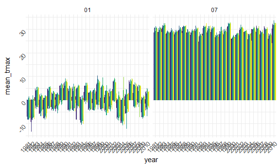
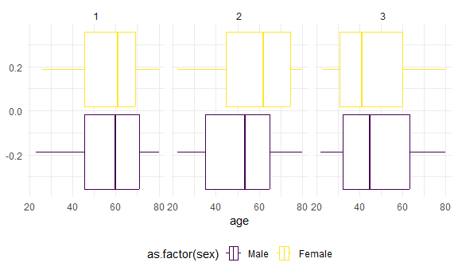
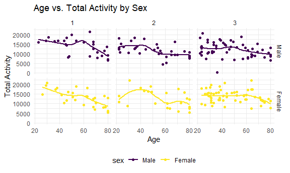
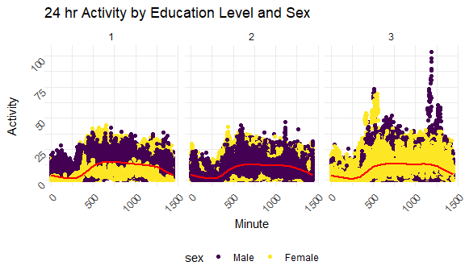
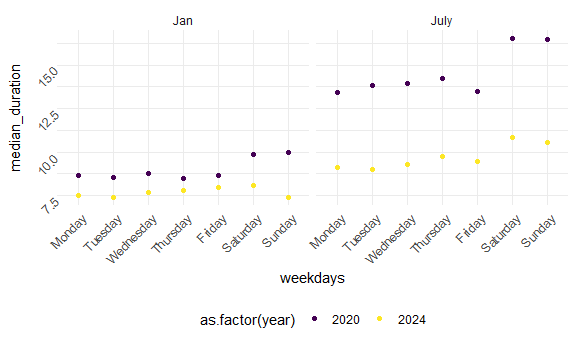
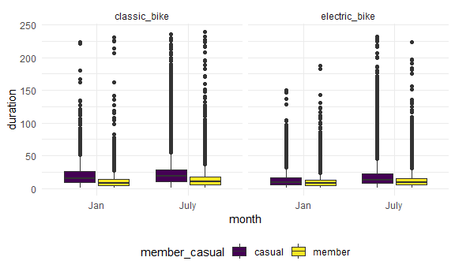

Homework 3
================
Mari Sanders

Using the `p8105 datasets` and `tidyverse` packages

# Problem 1

``` r
data("ny_noaa") 

noaa_df <- 
  ny_noaa %>% 
  separate(date, into = c("year", "month", "day"), sep = "-") %>% 
  
  mutate(tmax, tmax = as.integer(tmax) / 10) %>% 
  mutate(tmin, tmin = as.integer(tmin)/ 10) %>%  
  mutate(prcp, pcrp = as.integer(prcp)/ 10)

noaa_df %>% 
  group_by(snow) %>% 
  summarize(count = n())
```

    ## # A tibble: 282 × 2
    ##     snow   count
    ##    <int>   <int>
    ##  1   -13       1
    ##  2     0 2008508
    ##  3     3    8790
    ##  4     5    9748
    ##  5     8    9962
    ##  6    10    5106
    ##  7    13   23095
    ##  8    15    3672
    ##  9    18    3226
    ## 10    20    4797
    ## # ℹ 272 more rows

There is most commonly 0 mm of snow. This is because most days in NYC
mostly doesn’t snow.

``` r
noaa_df %>% 
  filter(month == "01" | month == "07") %>%  
  drop_na(tmax) %>%                           
  group_by(id, year, month) %>%               
  summarize(mean_tmax = mean(tmax, na.rm = TRUE), .group = "none") %>%  
   ggplot(aes(x = year, y = mean_tmax, color = id)) +
   geom_bar(stat = "identity", position = "dodge") +
  facet_grid(~month) + theme(legend.position = "none") + theme(axis.text = element_text(angle = 45, vjust = 1, hjust = 1))
```

    ## `summarise()` has grouped output by 'id', 'year'. You can override using the
    ## `.groups` argument.



The temperature in July seems to be much more predicable, with less
range in the average maximum temperature. There seems to be a max
temperature in 1982 that is extremely low compared to the other data.
Additionally, in 2005, there was another average temperature in January
that was a lot lower than the other data.

``` r
tmax_vs_tmin <- 
  noaa_df %>% 
  ggplot(aes(x = tmax, y = tmin)) + 
  geom_point()

snow <- 
  noaa_df %>% 
  group_by(year, snow) %>% 
  filter(snow > 0 | snow < 100) %>% 
  ggplot(aes(x = year, y = snow)) + geom_bar(stat = "identity", position = "dodge") 
```

# Problem 2

**Cleaning and Merging the Data**

``` r
accel_df <- 
  read_csv("data/nhanes_accel.csv") %>% 
  janitor::clean_names() 
```

    ## Rows: 250 Columns: 1441
    ## ── Column specification ────────────────────────────────────────────────────────
    ## Delimiter: ","
    ## dbl (1441): SEQN, min1, min2, min3, min4, min5, min6, min7, min8, min9, min1...
    ## 
    ## ℹ Use `spec()` to retrieve the full column specification for this data.
    ## ℹ Specify the column types or set `show_col_types = FALSE` to quiet this message.

``` r
demographic_df <- read_csv("data/nhanes_covar.csv", skip = 4) %>% 
  drop_na() %>% 
  janitor::clean_names() %>%
  filter(age > 21) %>%  
  mutate(sex, sex = factor(sex, levels = c(1,2), labels = c("Male", "Female"))) %>% 
  mutate(education, education = as.factor(education))
```

    ## Rows: 250 Columns: 5
    ## ── Column specification ────────────────────────────────────────────────────────
    ## Delimiter: ","
    ## dbl (5): SEQN, sex, age, BMI, education
    ## 
    ## ℹ Use `spec()` to retrieve the full column specification for this data.
    ## ℹ Specify the column types or set `show_col_types = FALSE` to quiet this message.

``` r
demographic_accel_df <- 
  left_join(demographic_df, accel_df, by = "seqn")
```

**Making Readable Table**

``` r
demographic_accel_df %>% 
  group_by(sex, education) %>%
  summarize(count = n())  %>%
  pivot_wider(names_from = sex, values_from = count) %>% knitr::kable()
```

    ## `summarise()` has grouped output by 'sex'. You can override using the `.groups`
    ## argument.

| education | Male | Female |
|:----------|-----:|-------:|
| 1         |   27 |     28 |
| 2         |   34 |     23 |
| 3         |   54 |     59 |

The most popular education level is 3. Both the male and female totals
are higher for this education level than any other education level. The
least popular education level is 1. Both male and female totals are
lower in this education level than any other education level.

**Creating age distributions for men and women in each category**

``` r
demographic_accel_df %>% 
  group_by(sex, age, education) %>% 
  ggplot(aes(x = age, color = as.factor(sex))) + 
  geom_boxplot() + 
  facet_grid(~education)
```



The only age that is quite different is for education level 2. For
females, the median age is a lot higher median age for males. Other than
that, most of the ages are similar. All the distributions seem slightly
skewed.

**Plot of Total Age Against Total Activity**

``` r
demographic_accel_df %>% 
  mutate(total_activity = rowSums(select(., starts_with("min")))) %>% 
  ggplot(aes(x = age, y = total_activity, color = sex)) + 
  geom_point() + 
  facet_grid(sex~education) + geom_smooth(se = FALSE) + 
  labs(
    x = "Age",
    y = "Total Activity",
    title = "Age vs. Total Activity by Sex"
  )
```

    ## `geom_smooth()` using method = 'loess' and formula = 'y ~ x'



Across all education levels, sexes, and ages, as age increases, total
activity decreases. For females with education = 2, there seems to be a
nonlinear relationship in the data.

**24-Hour Activity Time Courses for Each Education Level by Sex**

``` r
demographic_accel_df %>% 
  pivot_longer(
    cols = min1:min1440, 
    values_to = "activity",
    names_to = "minute", 
    names_prefix = "min"
  ) %>% ggplot(aes(x = as.numeric(minute), y = activity, color = sex)) + geom_point() + geom_smooth(color = "red") +  facet_grid(~education) + 
  labs(
    x = "Minute", 
    y = "Activity", 
    title = "24 hr Activity by Education Level and Sex"
  ) + 
  theme(axis.text = element_text(angle = 45, vjust = 1, hjust = 1))
```

    ## `geom_smooth()` using method = 'gam' and formula = 'y ~ s(x, bs = "cs")'



Across all education levels, there seem to be highs and lows in the
graphs, which seem to correspond to people being awake and people being
asleep. There are low levels of activity during the night and morning
hours. The activity patterns seem to be similar across education levels.
Education = 3 has much higher variation. There seems to be a similar
pattern based on sex as well. For females, there are is a bit higher
activity compared to males, especially during the middle part of the
day. There seems to be less variability/lower activity among males.

# Problem 3

**Cleaning and Joining Data**

``` r
jan_2020 <- read_csv("data/Jan_2020_Citi.csv") %>% 
  mutate(year = 2020) %>% 
  mutate(month = "Jan") %>% 
  relocate(year, month, .before = ride_id)
```

    ## Rows: 12420 Columns: 7
    ## ── Column specification ────────────────────────────────────────────────────────
    ## Delimiter: ","
    ## chr (6): ride_id, rideable_type, weekdays, start_station_name, end_station_n...
    ## dbl (1): duration
    ## 
    ## ℹ Use `spec()` to retrieve the full column specification for this data.
    ## ℹ Specify the column types or set `show_col_types = FALSE` to quiet this message.

``` r
jan_2024 <- read_csv("data/Jan_2024_Citi.csv") %>% 
  mutate(year = 2024) %>% 
  mutate(month = "Jan") %>% 
  relocate(year, month, .before = ride_id)
```

    ## Rows: 18861 Columns: 7
    ## ── Column specification ────────────────────────────────────────────────────────
    ## Delimiter: ","
    ## chr (6): ride_id, rideable_type, weekdays, start_station_name, end_station_n...
    ## dbl (1): duration
    ## 
    ## ℹ Use `spec()` to retrieve the full column specification for this data.
    ## ℹ Specify the column types or set `show_col_types = FALSE` to quiet this message.

``` r
july_2020 <- read_csv("data/July_2020_Citi.csv") %>% 
  mutate(year = 2020) %>% 
  mutate(month = "July") %>% 
  relocate(year, month, .before = ride_id)
```

    ## Rows: 21048 Columns: 7
    ## ── Column specification ────────────────────────────────────────────────────────
    ## Delimiter: ","
    ## chr (6): ride_id, rideable_type, weekdays, start_station_name, end_station_n...
    ## dbl (1): duration
    ## 
    ## ℹ Use `spec()` to retrieve the full column specification for this data.
    ## ℹ Specify the column types or set `show_col_types = FALSE` to quiet this message.

``` r
july_2024 <- read_csv("data/July_2024_Citi.csv") %>% 
  mutate(year = 2024) %>% 
  mutate(month = "July") %>% 
  relocate(year, month, .before = ride_id)
```

    ## Rows: 47156 Columns: 7
    ## ── Column specification ────────────────────────────────────────────────────────
    ## Delimiter: ","
    ## chr (6): ride_id, rideable_type, weekdays, start_station_name, end_station_n...
    ## dbl (1): duration
    ## 
    ## ℹ Use `spec()` to retrieve the full column specification for this data.
    ## ℹ Specify the column types or set `show_col_types = FALSE` to quiet this message.

``` r
citi_bike_df <- 
  bind_rows(jan_2020, july_2020, jan_2024, july_2024) 
```

The data includes 99485 rows and 9 columns. The variables included are
year, month, ride_id, rideable_type, weekdays, duration,
start_station_name, end_station_name, member_casual. The only things I
did to the datasets before I combined them was adding the year and month
of each observation and relocated the dates to be the first two columns
of the data set. I then used `bind_rows` to combine them because every
`join` function created separate columns instead of adding them to the
end of the first dataset.

**Total Number of Rides in Each Year and Month by Rider Type**

``` r
citi_bike_df %>% 
  group_by(year, month, member_casual) %>% 
  summarize(count = n()) %>% 
  pivot_wider(
    names_from = member_casual,
    values_from = count
  ) %>% 
  knitr::kable()
```

    ## `summarise()` has grouped output by 'year', 'month'. You can override using the
    ## `.groups` argument.

| year | month | casual | member |
|-----:|:------|-------:|-------:|
| 2020 | Jan   |    984 |  11436 |
| 2020 | July  |   5637 |  15411 |
| 2024 | Jan   |   2108 |  16753 |
| 2024 | July  |  10894 |  36262 |

Overall, there were a lot more users in 2024 than in 2020. The highest
amount of rides was in July 2024. The lowest amount of rides was January
of 2020 and the highest amount of rides was in July 2024.

**5 Most Popular Starting Stations in July 2024**

``` r
citi_bike_df %>% 
  filter(month == "July" & year == "2024") %>% 
  group_by(start_station_name) %>% 
  summarize(count = n()) %>%  arrange(desc(count)) %>% head(5) %>% knitr::kable()
```

| start_station_name       | count |
|:-------------------------|------:|
| Pier 61 at Chelsea Piers |   163 |
| University Pl & E 14 St  |   155 |
| W 21 St & 6 Ave          |   152 |
| West St & Chambers St    |   150 |
| W 31 St & 7 Ave          |   146 |

The most popular starting stations in July 2024 is Pier 61 at Chelsea
Piers, University Pl & E 14 St., W 21 St. & 6 Ave, West St & Chambers
St, and W 31 & 7 Ave.

**Effects of Weekday, Month and Year on Median Ride Duration**

``` r
citi_bike_df %>%
  mutate(weekdays = factor(weekdays, 
                           levels = c("Monday", "Tuesday", "Wednesday", "Thursday", "Friday", "Saturday", "Sunday"), 
                           ordered = TRUE)) %>% 
  group_by(year, month, weekdays) %>% 
  mutate(median_duration = median(duration)) %>% ggplot(aes(x = weekdays, y = median_duration, color = as.factor(year))) + geom_point() + facet_grid(~month) + theme(axis.text = element_text(angle = 45, vjust = 1, hjust = 1))
```



The median duration is higher in July 2020 than any other time in this
graph. There seem to typically be longer duration rides on Saturday and
Sunday than any other days of the week. The duration overall is less in
2024 than it was in 2020.

**Plot of Impact on Month, Membership Status, and Bike Type on Ride
Duration**

``` r
citi_bike_df %>% 
  group_by(month, member_casual, rideable_type, duration) %>% 
  ggplot(aes(x = month, y = duration, fill = member_casual)) +
  geom_boxplot() + 
  facet_grid(~rideable_type)
```



There is not much of a difference between the classic bike and the
electric bike. It does seem like the median duration is shorter for
members rather than casual users.There are a lot of outliers in this
dataset. There seems to be a larger range for the classic bike in both
January and July, when compared with January and July for the electric
bike. In January, for both the classic bike and the electric bike, they
both had much smaller ranges. This seems to suggest that people are
taking much shorter rides in January than in July.
