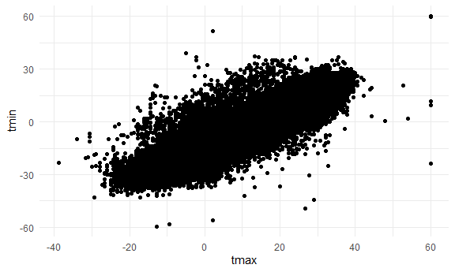

Homework 3
================
Mari Sanders
2024-10-05

# Problem 1

``` r
data("ny_noaa") 

noaa_df <- 
  ny_noaa %>% 
  separate(date, into = c("year", "month", "day"), sep = "-") %>% 
  
  mutate(tmax, tmax = as.integer(tmax) / 10) %>% 
  mutate(tmin, tmin = as.integer(tmin)/ 10) %>%  
  mutate(prcp, pcrp = as.integer(prcp)/ 10)

noaa_df %>% 
  group_by(snow) %>% 
  summarize(count = n())
```

    ## # A tibble: 282 × 2
    ##     snow   count
    ##    <int>   <int>
    ##  1   -13       1
    ##  2     0 2008508
    ##  3     3    8790
    ##  4     5    9748
    ##  5     8    9962
    ##  6    10    5106
    ##  7    13   23095
    ##  8    15    3672
    ##  9    18    3226
    ## 10    20    4797
    ## # ℹ 272 more rows

There is most commonly 0 mm of snow. This is because most days in NYC
mostly doesn’t snow.

``` r
noaa_df %>% 
  filter(month == "01" | month == "07") %>%  
  drop_na(tmax) %>%                           
  group_by(id, year, month) %>%               
  summarize(mean_tmax = mean(tmax, na.rm = TRUE), .group = "none") %>%  
   ggplot(aes(x = year, y = mean_tmax, color = id)) +
   geom_bar(stat = "identity", position = "dodge") +
  facet_grid(~month) + theme(legend.position = "none") + theme(axis.text = element_text(angle = 45, vjust = 1, hjust = 1))
```

    ## `summarise()` has grouped output by 'id', 'year'. You can override using the
    ## `.groups` argument.


The temperature in July seems to be much more predicable, with less
range in the average maximum temperature. There seems to be a max
temperature in 1982 that is extremely low compared to the other data.
Additionally, in 2005, there was another average temperature in January
that was a lot lower than the other data.

``` r
noaa_df %>% 
  ggplot(aes(x = tmax, y = tmin)) + 
  geom_point()
```

    ## Warning: Removed 1136276 rows containing missing values or values outside the scale
    ## range (`geom_point()`).



``` r
noaa_df %>% 
  group_by(year, snow) %>% 
  filter(snow > 0 | snow < 100) %>% 
  ggplot(aes(x = year, y = snow)) + geom_bar(stat = "identity", position = "dodge") 
```


# Problem 2

``` r
accel_df <- 
  read_csv("data/nhanes_accel.csv") %>% 
  janitor::clean_names() 
```

    ## Rows: 250 Columns: 1441
    ## ── Column specification ────────────────────────────────────────────────────────
    ## Delimiter: ","
    ## dbl (1441): SEQN, min1, min2, min3, min4, min5, min6, min7, min8, min9, min1...
    ## 
    ## ℹ Use `spec()` to retrieve the full column specification for this data.
    ## ℹ Specify the column types or set `show_col_types = FALSE` to quiet this message.

``` r
demographic_df <- read_csv("data/nhanes_covar.csv", skip = 4) %>% 
  drop_na() %>% 
  janitor::clean_names() %>%
  filter(age > 21) %>%  
  mutate(sex, sex = as.factor(sex)) %>% 
  mutate(education, education = as.factor(education))
```

    ## Rows: 250 Columns: 5
    ## ── Column specification ────────────────────────────────────────────────────────
    ## Delimiter: ","
    ## dbl (5): SEQN, sex, age, BMI, education
    ## 
    ## ℹ Use `spec()` to retrieve the full column specification for this data.
    ## ℹ Specify the column types or set `show_col_types = FALSE` to quiet this message.

``` r
demographic_accel_df <- 
  left_join(demographic_df, accel_df, by = "seqn")
```

``` r
demographic_accel_df %>% 
  group_by(sex, education) %>%
  summarize(count = n()) %>% 
  knitr::kable()
```

    ## `summarise()` has grouped output by 'sex'. You can override using the `.groups`
    ## argument.

| sex | education | count |
|:----|:----------|------:|
| 1   | 1         |    27 |
| 1   | 2         |    34 |
| 1   | 3         |    54 |
| 2   | 1         |    28 |
| 2   | 2         |    23 |
| 2   | 3         |    59 |

``` r
demographic_accel_df %>% 
  group_by(sex, age, education) %>% 
  ggplot(aes(x = age, color = as.factor(sex))) + 
  geom_boxplot() + 
  facet_grid(~education)
```


The only age that is quite different is for education level 2. For
females, the median age is a lot higher median age for males. Other than
that, most of the ages are similar. All the distributions seem slightly
skewed.

``` r
demographic_accel_df %>% 
  mutate(total_activity = rowSums(select(., starts_with("min")))) %>% 
  ggplot(aes(x = age, y = total_activity, color = sex)) + 
  geom_point() + 
  facet_grid(sex~education) + geom_smooth(se = FALSE) 
```

    ## `geom_smooth()` using method = 'loess' and formula = 'y ~ x'


Across all education levels, sexes, and ages, as age increases, total
activity decreases. For Females with education = 2, there seems to be a
nonlinear relationship in the data. The other graphs could be able to be
explained using a linear model, but further testing is needed.

``` r
demographic_accel_df %>% 
  pivot_longer(
    cols = min1:min1440, 
    values_to = "data",
    names_to = "minute", 
    names_prefix = "min"
  ) %>% ggplot(aes(x = minute, y = data, color = sex)) + geom_point() + facet_grid(~education) + geom_smooth()
```

    ## `geom_smooth()` using method = 'loess' and formula = 'y ~ x'


# Problem 3

``` r
jan_2020 <- read_csv("data/Jan_2020_Citi.csv") %>% 
  mutate(year = 2020) %>% 
  mutate(month = "Jan") %>% 
  relocate(year, month, .before = ride_id)
```

    ## Rows: 12420 Columns: 7
    ## ── Column specification ────────────────────────────────────────────────────────
    ## Delimiter: ","
    ## chr (6): ride_id, rideable_type, weekdays, start_station_name, end_station_n...
    ## dbl (1): duration
    ## 
    ## ℹ Use `spec()` to retrieve the full column specification for this data.
    ## ℹ Specify the column types or set `show_col_types = FALSE` to quiet this message.

``` r
jan_2024 <- read_csv("data/Jan_2024_Citi.csv") %>% 
  mutate(year = 2024) %>% 
  mutate(month = "Jan") %>% 
  relocate(year, month, .before = ride_id)
```

    ## Rows: 18861 Columns: 7
    ## ── Column specification ────────────────────────────────────────────────────────
    ## Delimiter: ","
    ## chr (6): ride_id, rideable_type, weekdays, start_station_name, end_station_n...
    ## dbl (1): duration
    ## 
    ## ℹ Use `spec()` to retrieve the full column specification for this data.
    ## ℹ Specify the column types or set `show_col_types = FALSE` to quiet this message.

``` r
july_2020 <- read_csv("data/July_2020_Citi.csv") %>% 
  mutate(year = 2020) %>% 
  mutate(month = "July") %>% 
  relocate(year, month, .before = ride_id)
```

    ## Rows: 21048 Columns: 7
    ## ── Column specification ────────────────────────────────────────────────────────
    ## Delimiter: ","
    ## chr (6): ride_id, rideable_type, weekdays, start_station_name, end_station_n...
    ## dbl (1): duration
    ## 
    ## ℹ Use `spec()` to retrieve the full column specification for this data.
    ## ℹ Specify the column types or set `show_col_types = FALSE` to quiet this message.

``` r
july_2024 <- read_csv("data/July_2024_Citi.csv") %>% 
  mutate(year = 2024) %>% 
  mutate(month = "July") %>% 
  relocate(year, month, .before = ride_id)
```

    ## Rows: 47156 Columns: 7
    ## ── Column specification ────────────────────────────────────────────────────────
    ## Delimiter: ","
    ## chr (6): ride_id, rideable_type, weekdays, start_station_name, end_station_n...
    ## dbl (1): duration
    ## 
    ## ℹ Use `spec()` to retrieve the full column specification for this data.
    ## ℹ Specify the column types or set `show_col_types = FALSE` to quiet this message.

``` r
citi_bike_df <- 
  bind_rows(jan_2020, july_2020, jan_2024, july_2024) 
```

``` r
citi_bike_df %>% 
  group_by(year, month, member_casual) %>% 
  summarize(count = n()) %>%
  knitr::kable()
```

    ## `summarise()` has grouped output by 'year', 'month'. You can override using the
    ## `.groups` argument.

| year | month | member_casual | count |
|-----:|:------|:--------------|------:|
| 2020 | Jan   | casual        |   984 |
| 2020 | Jan   | member        | 11436 |
| 2020 | July  | casual        |  5637 |
| 2020 | July  | member        | 15411 |
| 2024 | Jan   | casual        |  2108 |
| 2024 | Jan   | member        | 16753 |
| 2024 | July  | casual        | 10894 |
| 2024 | July  | member        | 36262 |

OVerall, there were a lot more users in 2024 than in 2020. The highest
amount of rides was in July 2024. THe lowest amount of rides was January
of 2020.

``` r
citi_bike_df %>% 
  filter(month == "July" & year == "2024") %>% 
  group_by(start_station_name) %>% 
  summarize(count = n()) %>%  arrange(desc(count)) %>% head(5) %>% knitr::kable()
```

| start_station_name       | count |
|:-------------------------|------:|
| Pier 61 at Chelsea Piers |   163 |
| University Pl & E 14 St  |   155 |
| W 21 St & 6 Ave          |   152 |
| West St & Chambers St    |   150 |
| W 31 St & 7 Ave          |   146 |

``` r
citi_bike_df %>%
  mutate(weekdays = factor(weekdays, 
                           levels = c("Monday", "Tuesday", "Wednesday", "Thursday", "Friday", "Saturday", "Sunday"), 
                           ordered = TRUE)) %>% 
  group_by(year, month, weekdays) %>% 
  mutate(median_duration = median(duration)) %>% ggplot(aes(x = weekdays, y = median_duration, fill = as.factor(year))) + geom_bar(stat = "identity", position = "dodge") + facet_grid(~month) + theme(axis.text = element_text(angle = 45, vjust = 1, hjust = 1))
```


The median duration is higher in July 2020 than any other time in this
graph. There seem to typically be longer duration rides on Saturday and
Sunday than any other days of the week. The duration overall is less in
2024 than it was in 2020.

``` r
citi_bike_df %>% 
  group_by(month, member_casual, rideable_type, duration) %>% 
  ggplot(aes(x = month, y = duration, fill = member_casual)) +
  geom_boxplot() + 
  facet_grid(~rideable_type)
```


There is not much of a difference between the classic bike and the
electric bike. It does seem like the median duration is shorter for
members rather than casual users.There are a lot of outliers in this
dataset. There seems to be a larger range for the classic bike in both
January and July, when compared with January and July for the electric
bike. In January, for both the classic bike and the electric bike, they
both had much smaller ranges. This seems to suggest that people are
taking much shorter rides in January than in July.
